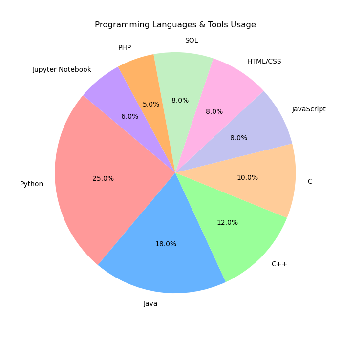

# 👩‍🏫 Hello, I'm Suraiya Mahmuda

---

## 💼 About Me

- 🎓 Final-year undergraduate student, CSE, Jahangirnagar University.
- 🔐 Career goal: Become a faculty member and researcher in Cybersecurity.
- 💻 Proficient in **Python**, **Java**, **C++**, **Django**, and **Machine Learning Frameworks**.
- 🌱 Currently exploring **BERT**, **NLP**, **LLM**, and **Secure Web Systems**.
- 👩‍🏫 Research Interests: **Cyber Security**, **Machine Learning**, **Deep Learning**, **NLP**.

---

## 🚀 Major Projects

| Project Name   |     Date     | Description |
|--------------|--------------|-------------|
| 📚 **[Fake News Classification](https://github.com/SuraiyaMahmuda/Fake-News-Classification)**   |     May 2025     | Built with Python, TensorFlow, and Keras, this project uses a CNN to classify bird species from images. It includes image preprocessing with OpenCV and NumPy, plus visualization and evaluation using Matplotlib and Scikit-learn. |
| 🐦 **[Bird Classification](https://github.com/SuraiyaMahmuda/Bird-Classification)**   |     Mar 2025     | Built with Python, TensorFlow, and Keras, this project uses a CNN to classify bird species from images. It includes image preprocessing with OpenCV and NumPy, plus visualization and evaluation using Matplotlib and Scikit-learn. |
| 🐶 **[Animal Face Classification](https://github.com/SuraiyaMahmuda/Animal-Face-Classification)**   |     Mar 2025     | This project uses Python with TensorFlow and Keras to build a CNN for classifying animal faces. Developed in Jupyter Notebook, it applies image preprocessing with OpenCV and NumPy, and uses Matplotlib and Scikit-learn for evaluation and visualization. |
| 📚 **[TutorFinderApp](https://github.com/SuraiyaMahmuda/TutorFinderApp)**   |     Dec 2024     | An Android app built with Java that connects students and parents with tutors. It uses Firebase Authentication, MySQL backend with Slim framework API, Google Maps for location, and Firebase Cloud Messaging for notifications. |
| 🏫 **[Ju-Exam-Office-Management-System](https://github.com/SuraiyaMahmuda/Ju-Exam-Office-Management-System)**   |     Nov 2024     | Ju-Exam-Office-Management-System is a Django-based web app for managing exam workflows, certificate applications, and approvals at Jahangirnagar University using Python, HTML/CSS, Bootstrap, and SQLite/PostgreSQL. |
| 🤖 **[An-Obstacle-Avoiding-Robot](https://github.com/SuraiyaMahmuda/An-Obstacle-Avoiding-Robot)**   |     Mar 2024     | An Arduino-based robot that uses ultrasonic sensors and servo motors to detect and avoid obstacles, programmed with C/C++ in the Arduino IDE. |
| 💍 **[Matrimony-Biye-Shaadi](https://github.com/SuraiyaMahmuda/Matrimony-Biye-Shaadi)**   |     Jan 2024     | Matrimony-Biye-Shaadi is a matchmaking web app built with HTML, CSS, JavaScript, PHP, and MySQL, allowing users to create profiles, browse matches, and connect based on preferences. |

---

## 🛠️ Programming Languages Usage

---

## 🧰 Tech Stack

**Languages**     : Python, Java, C++, HTML/CSS, JavaScript, SQL  
**Frameworks**    : Django, Android (Java), Flask  
**Tools**         : Git, GitHub, CI/CD, Firebase, Arduino IDE, Jupyter Notebook  
**ML/NLP Tools**  : Scikit-learn, TensorFlow, Keras, BanglaBERT  

---

## 📊 GitHub Stats

### [Suraiya Mahmuda's GitHub Stats](https://github.com/SuraiyaMahmuda)

- ⭐ **Total Stars Earned:** 0  
- 📈 **Total Commits (2025):** 345  
- 📈 **Total Commits (2024):** 280  
- 🔀 **Total PRs:** 0  
- ❗ **Total Issues:** 0  
- ⌛ **Contributed to (last year):** 2  

---

## 📬 How to reach me
 
- 🌐 Portfolio: [Portfolio/Suraiya Mahmuda](https://suraiyamahmuda.github.io/) 
- 💼 LinkedIn: [LinkedIn/Suraiya Mahmuda](https://www.linkedin.com/in/suraiya-mahmuda-861779326)  
- 📧 Email: [suraiya2001mahmuda@gmail.com](mailto:suraiya2001mahmuda@gmail.com) 
- 📍 Location: Dhaka, Bangladesh

---
